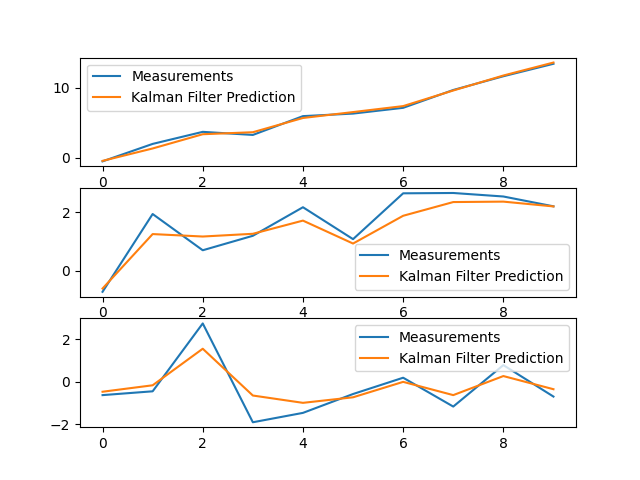

# Kalman Filter Implementation

This project implements a Kalman Filter to process data from sensors. The Kalman Filter is a powerful tool for estimating the state of a system based on noisy measurements. This implementation demonstrates how to initialize, predict, and update the state estimates using the Kalman Filter.

## Table of Contents

- [Overview](#overview)
- [Requirements](#requirements)
- [Setup](#setup)
- [Usage](#usage)
- [Output](#output)
- [Explanation](#explanation)

## Overview

The Kalman Filter is implemented in Python and is designed to handle a state vector of arbitrary dimensions. The filter can be used to process sensor data and provide estimates of the true state of the system.

## Requirements

- Python 3.x
- NumPy
- Matplotlib

## Setup

1. Clone the repository:

   ```bash
   git clone https://github.com/your-username/kalman-filter.git
   cd kalman-filter
   ```
2. Install the required packages:

   ```bash
   pip install numpy matplotlib
   ```

## Usage

1. Run the `kalman_filter.py` script to see the Kalman Filter in action:

   ```bash
   python kalman_filter.py
   ```
2. The script will simulate some sensor data, process it using the Kalman Filter, and display the results.

## Output

The output will include plots of the measurements and the Kalman Filter predictions for each component of the state vector.



## Explanation

### Kalman Filter Class

The `KalmanFilter` class implements the Kalman Filter algorithm. It includes methods for initialization, prediction, and update.

- **Initialization (`__init__`)**: Sets up the state transition matrix `F`, control matrix `B`, initial state estimate `x`, covariance matrix `P`, process noise covariance `Q`, measurement noise covariance `R`, and measurement matrix `H`.
- **Prediction (`predict`)**: Computes the predicted state estimate and covariance matrix based on the state transition matrix and control input.
- **Update (`update`)**: Updates the state estimate and covariance matrix using the measurement vector `z`.

### Main Script

The main script demonstrates the usage of the `KalmanFilter` class by simulating some sensor data and processing it using the filter. It plots the measurements and the filter's predictions for comparison.

- **Simulated Data**: The script simulates a true state vector and adds noise to generate measurements.
- **Kalman Filter Processing**: The filter processes the measurements to provide estimates of the true state.
- **Plotting Results**: The results are plotted to visualize the filter's performance.


## References

- [Understanding the Basis of the Kalman Filter via a Simple and Intuitive Derivation](https://arxiv.org/pdf/1204.0375)
- [How a Kalman Filter Works in Pictures](https://www.bzarg.com/p/how-a-kalman-filter-works-in-pictures/#mjx-eqn-kalpredictfull)
- [Kalman Filter](https://web.mit.edu/kirtley/kirtley/binlustuff/literature/control/Kalman%20filter.pdf)
- [Understanding Kalman Filters with Python](https://medium.com/@jaems33/understanding-kalman-filters-with-python-2310e87b8f48)
